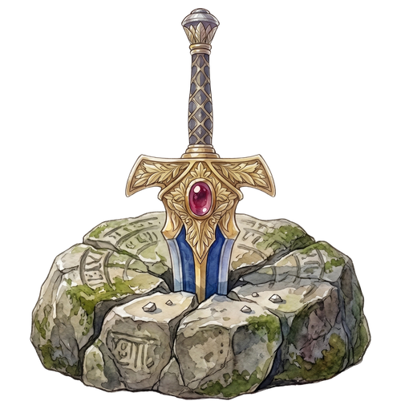

# 𝙷𝚒, 𝙸'𝚖 𝙳𝚒𝚝𝚢𝚊!

𝙱𝚞𝚒𝚕𝚍𝚒𝚗𝚐: 𝙰𝚞𝚝𝚘𝚗𝚘𝚖𝚘𝚞𝚜 𝚂𝚞𝚛𝚏𝚊𝚌𝚎 𝚅𝚎𝚑𝚒𝚌𝚕𝚎 𝚊𝚝 **𝙱𝚎𝚗𝚐𝚊𝚠𝚊𝚗 𝚄𝚅** 
𝙴𝚡𝚙𝚕𝚘𝚛𝚒𝚗𝚐: 𝚆𝚎𝚋 𝙳𝚎𝚟 & 𝙰𝙸/𝙼𝙻

  <a href="https://portfolio-adityamulyaf.vercel.app/">𝙿𝚘𝚛𝚝𝚏𝚘𝚕𝚒𝚘</a> · 
  <a href="https://linkedin.com/in/firizqi-aditya-mulya">𝙻𝚒𝚗𝚔𝚎𝚍𝙸𝚗</a> · 
  <a href="mailto:adityamulyaf@gmail.com">𝙴𝚖𝚊𝚒𝚕</a>

---

𝚃𝚎𝚌𝚑 𝚂𝚝𝚊𝚌𝚔:
* 𝚁𝚘𝚋𝚘𝚝𝚒𝚌𝚜 / 𝙰𝙸: `Python` `ROS` `OpenCV` `PyTorch` `YOLO` `TFLite` `CUDA`
* 𝚆𝚎𝚋 𝙳𝚎𝚟: `React` `Next.js` `Laravel` `TailwindCSS` `MySQL` `PostgreSQL`
* 𝙻𝚊𝚗𝚐𝚞𝚊𝚐𝚎𝚜: `C` `Java` `JavaScript` `PHP`

---

  
𝚂𝚝𝚊𝚝𝚜

   
  
    
   
  
    
  

  
  
𝙲𝚘𝚗𝚐𝚛𝚊𝚝𝚜! 𝚈𝚘𝚞 𝚓𝚞𝚜𝚝 𝚏𝚘𝚞𝚗𝚍 𝚝𝚑𝚎 𝙷𝚎𝚛𝚘'𝚜 𝚂𝚠𝚘𝚛𝚍!

  
   
  <i>(𝙲𝚕𝚒𝚌𝚔 𝚝𝚑𝚎 𝚜𝚠𝚘𝚛𝚍 𝚝𝚘 𝚙𝚞𝚕𝚕 𝚒𝚝 𝚘𝚞𝚝)</i>

